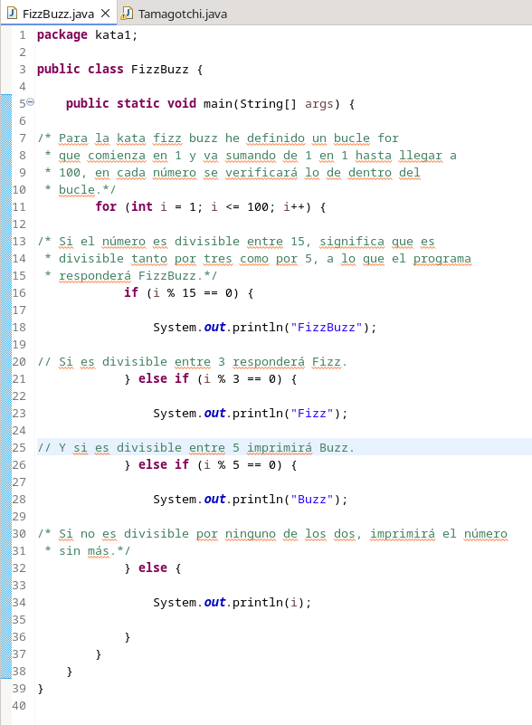
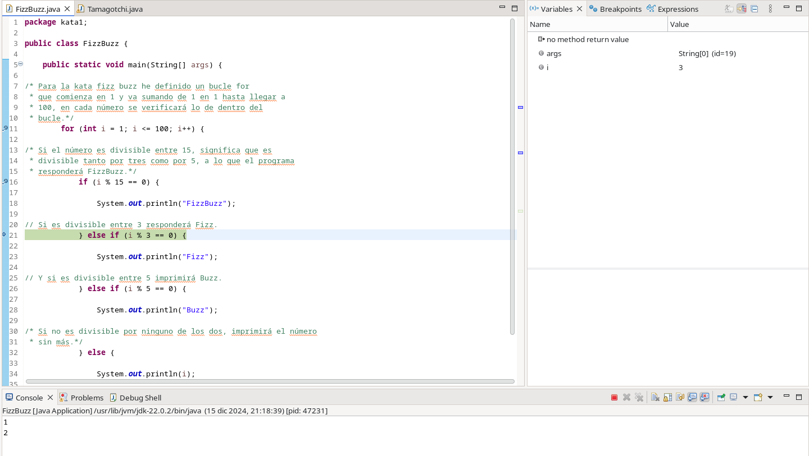
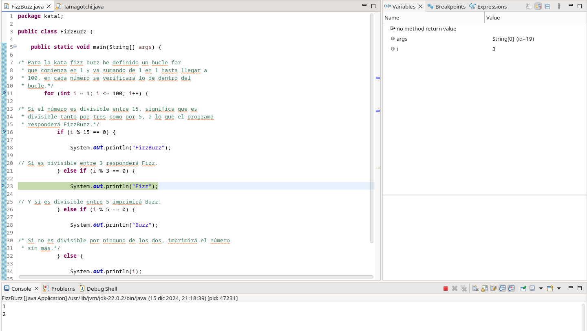
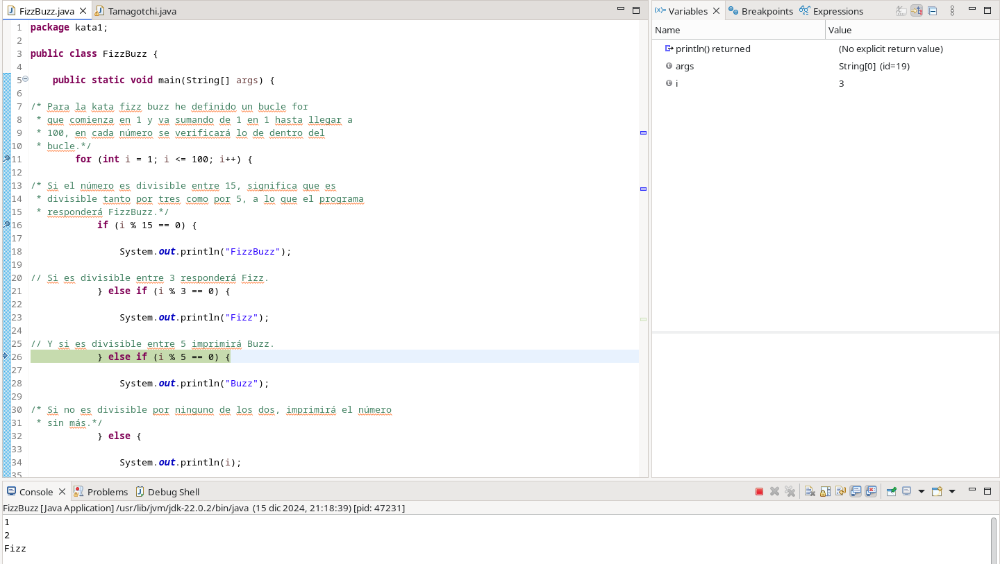
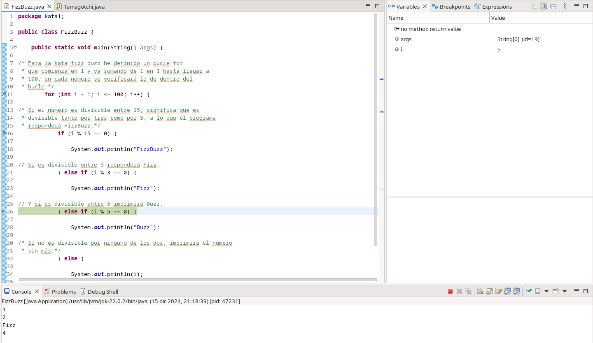

# Resolución de Katas en Java y Depuración
#### Proyecto realizado por Francisco Javier Díaz Miranda
En este proyecto veremos la realización y depuración de dos problemas o Katas en java, utilizando la  
Herramienta de desarrollo integrado Eclipse. Después de ver su realización en capturas de código,  
veremos cómo funciona y si funciona correctamente cada uno de los programas mediante la herramienta  
de depuración que nos proporciona Eclipse.
### Kata 1 FizzBuzz
En esta kata tenemos que resolver un problema en Java, en el cual el enunciado nos dice, simplificadamente,  
que tenemos que imprimir por pantalla los números del 1 al 100, y en los números múltiplos de 3 debe imprimir  
Fizz y en los múltiplos de 5 Buzz, para los múltiplos de ambos FizzBuzz.  
En la clase que hemos creado, en el método main, resolvemos este problema con un bucle for, y definiendo  
que en cada uno de los múltiplos que hemos mencionado se imprima la palabra antes dicha.
#### Código Completo FizzBuzz

### Kata 2 Tamagotchi
En la kata Tamagotchi tenemos que realizar una similitud a los famosos juguetes distribuidos por Bandai  
hace años, en los que tendremos a nuestra disposición una mascota virtual con atributos y posibles acciones.  
Solucionamos la kata definiendo los atributos que se piden, hambre, energía y humor, y con los métodos  
que tiene el tamagotchi, comer, jugar y dormir, a los que les he sumado un método que permite devolver  
un valor de cadena de caractéres que nos indica el estado de nuestra mascota virtual mediante el uso  
de simbolismos similares a emojis.  
Finalmente probamos nuestro tamagotchi en un método main con nuestra mascota Tom, usando los métodos  
que hemos definido.
#### Código Completo Tamagotchi

## Depuración de las Katas
Veremos la depuración de las katas en las siguientes capturas
### Depuración FizzBuzz
Depuración del 3, primero vemos como entra a la línea de la condición que sea divisible entre 3
y en las dos capturas siguientes cómo se imprime en la consola:

Depuración del 5, vemos cómo se va al caso de que sea divisible entre 5 y va a la línea para imprimir
por pantalla Buzz, pero después de eso no se muestra cómo se imprime (que sí lo hace):

### Depuración Tamagotchi
Depuración de imprimir pantalla y el método que imprime:

El método jugar depurado, a la derecha se ven el valor de las variables y su cambio a lo largo de la  
realización del código, al final se ven los valores que se quedarán y por último el paso a la siguiente
línea de imprimir:

